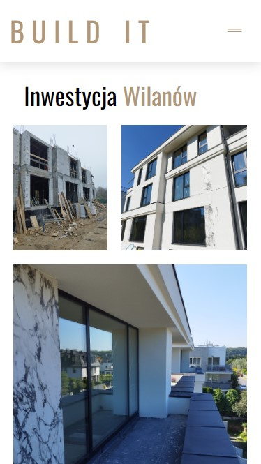
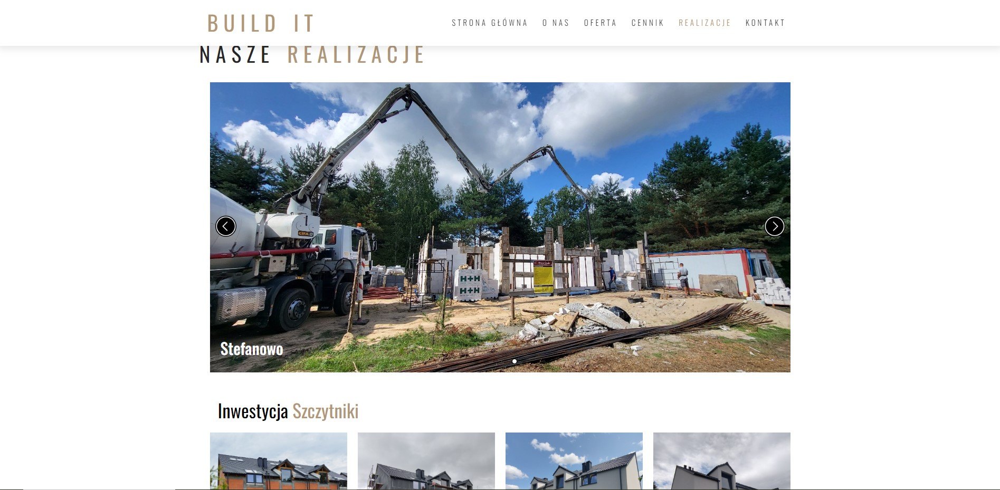

# Build IT gallery
Next.js build.IT website editions and added gallery with swiper and photo album.

## Table of contents
- [Live](#live)
- [How To Install](#how-to-install)
- [Technologies](#technologies)
- [Functionalities](#functionalities)
- [Screens](#screens)

## Live
https://buildit-warszawa.pl/realizacje/

## How To Install

First, run the development server:

```bash
npm run dev
# or
yarn dev
```

Open [http://localhost:3000](http://localhost:3000) with your browser to see the result.
  
## Technologies

Project was created with:

- next.js
- swiper
- photo album
- lightbox

## Functionalities

- gallery with swiper, photo album and lightbox combined.

## Screens
* gallery :computer:


* gallery :iphone:



